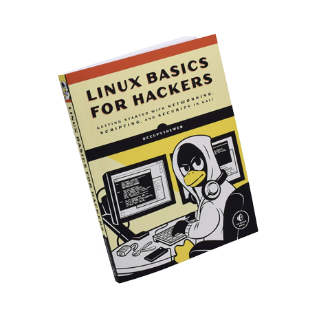
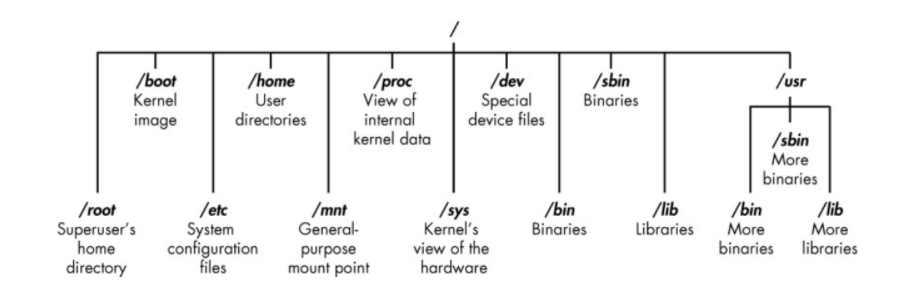
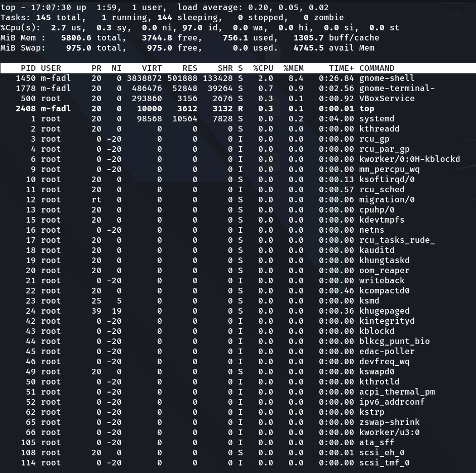
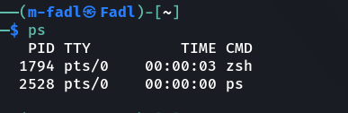
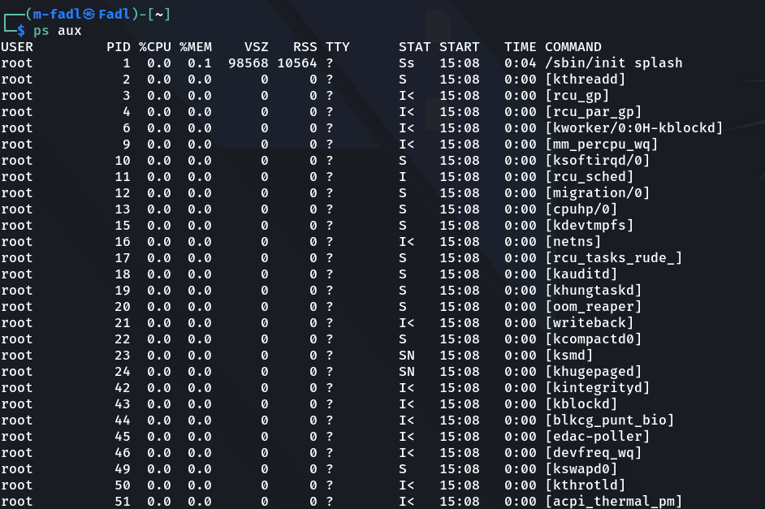

# CAT CyberSecurity Circle Linux Task


| 📝Chapter  | 🔎Content |
| --- | --- |
| [What is the task](#what-is-the-task) | What is needed from us in this task |
| [Book Details](#book-details) | Some info about the book |
| [Introduction](#introduction) | An introduction to the  book content |
| [Chapter #1](#chapter-1) | GETTING STARTED WITH THE BASICS |
| [Chapter #2](#chapter-2) | TEXT MANIPULATION |
| [Chapter #3](#chapter-3) | ANALYZING AND MANAGING NETWORKS |
| [Chapter #4](#chapter-4) | ADDING AND REMOVING SOFTWARE |
| [Chapter #5](#chapter-5) | CONTROLLING FILE AND DIRECTORY PERMISSIONS |
| [Chapter #6](#chapter-6) | PROCESS MANAGEMENT |
| [Chapter #7](#chapter-7) | MANAGING USER ENVIRONMENT VARIABLES |
| [Chapter #8](#chapter-8) | BASH SCRIPTING |
| [Chapter #9](#chapter-9) | COMPRESSING AND ARCHIVING |

---

# What is the task:

> we are asked to make a summary for [LINUX BASICS FOR HACKERS Book](http://bit.ly/2Kn93MS) 👨🏻‍💻👨🏻‍💻

 <br/>

<p align="center">
  <b><a href="http://bit.ly/2Kn93MS">LINUX BASICS FOR HACKERS Book</a></b>
</p>

---

# Book Details:

**This practical, tutorial-style book uses the Kali Linux distribution to teach Linux basics with a focus on how hackers would use them. Topics include Linux command line basics, filesystems, networking, BASH basics, package management, logging, and the Linux kernel and drivers.**

If you're getting started along the exciting path of hacking, cybersecurity, and pentesting, Linux Basics for Hackers is an excellent first step. Using Kali Linux, an advanced penetration testing distribution of Linux, you'll learn the basics of using the Linux operating system and acquire the tools and techniques you'll need to take control of a Linux environment.

First, you'll learn how to install Kali on a virtual machine and get an introduction to basic Linux concepts. Next, you'll tackle broader Linux topics like manipulating text, controlling file and directory permissions, and managing user environment variables. You'll then focus in on foundational hacking concepts like security and anonymity and learn scripting skills with bash and Python. Practical tutorials and exercises throughout will reinforce and test your skills as you learn how to:

- Cover your tracks by changing your network information and manipulating the rsyslog logging utility
- Write a tool to scan for network connections, and connect and listen to wireless networks
- Keep your internet activity stealthy using Tor, proxy servers, VPNs, and encrypted email
- Write a bash script to scan open ports for potential targets
- Use and abuse services like MySQL, Apache web server, and OpenSSH
- Build your own hacking tools, such as a remote video spy camera and a password cracker

Hacking is complex, and there is no single way in. Why not start at the beginning with Linux Basics for Hackers?

---

# Introduction

Hacking is the most important skill set of the 21st century! Nations are spying on each other to gain secrets, cyber criminals are stealing billions of dollars, digital worms demanding ransoms are being released, adversaries are influencing each other’s elections, and combatants are taking down each other’s utilities. These are all the work of hackers, and their influence over our increasingly digital world is just beginning to be felt.

Any person who wants to become a professional hacker must know Linux and know how to deal with this OS because Almost all the best hacker tools are written for Linux, so some basic Linux skills are a prerequisite to becoming a professional hacker.

---

# Chapter #1

> This chapter will teach you how to use the file system and the terminal, and give you some basic commands.

## GETTING STARTED WITH THE BASICS

## Some Concepts:

- **_Binaries :-_** Binaries This term refers to files that can be executed, similar to executables in Windows. Binaries generally reside in the /usr/bin or usr/sbin directory and include utilities such as ps, cat, ls, and cd as well as applications such as the wireless hacking tool aircrack­ng and the intrusion detection system (IDS) Snort.

- **_Directory :-_** This is the same as a folder in Windows. A directory provides a way of
  organizing files, usually in a hierarchical manner.

- **_Home :-_** Each user has their own /home directory, and this is generally where files you
  create will be saved by default.

- **_root :-_** is the user name or account that by default has access to all commands and files on a Linux or other Unix-like operating system. It is also referred to as the root account, root user and the superuser.

- **_Script :-_** This is a series of commands run in an interpretive environment that converts
  each line to source code.

- **_Shell :-_** is the command interpreter in an operating system such as Unix or GNU/Linux, it is a program that executes other programs. It provides a computer user an interface to the Unix/GNU Linux system so that the user can run different commands or utilities/tools with some input data.

- **_Terminal :-_** is a command line interface (CLI).

## Linux Filesystem:

The Linux filesystem structure is somewhat different from that of Windows. Linux doesn’t have a physical drive (such as the C: drive) at the base of the filesystem but uses
a logical filesystem instead. At the very top of the filesystem structure is / (root)



> Linux Filesystem

- **/root** The home directory of the all­powerful root user

- **/etc** Generally contains the Linux configuration files—files that control when and how
  programs start up

- **/home** The user’s home directory

- **/mnt** Where other filesystems are attached or mounted to the filesystem

- **/media** Where CDs and USB devices are usually attached or mounted to the filesystem

- **/bin** Where application binaries (the equivalent of executables in Microsoft Windows)
  reside

- **/lib** Where you’ll find libraries (shared programs that are similar to Windows DLLs)

## BASIC COMMANDS IN LINUX

- Finding Yourself with **pwd**

  `pwd` => return the present working directory

- Checking Your Login with **whoami**

  `whoami` => return the user which logged in

- Changing Directories with **cd**

  `cd dirName` => change the directory to dirName directory

  `cd ..` => move up one level in the file structure

- Listing the Contents of a Directory with **ls**

  `ls` => return the contents of current directory (files and directories)

  we can add **arguments (flags)** to `ls` command to see extra information such as `ls -l` this get more information about the files and directories, such as their permissions, owner, size, and when they were last modified.

  or `-R` flag to list Subdirectories recursively

- Getting Help: Nearly every command, application, or utility has a dedicated help file in Linux that
  provides guidance for its use.

  to get help for specific commands, add `--help` to get the help ex:

  ` ls --help` => return short description of the tool and guidance on how to use it.

- Referencing Manual Pages with **man**

  In addition to the help switch, most commands and applications have a manual (man) page with more information, such as a description and synopsis of the command or application. You can view a man page by simply typing manbefore the command, utility, or application.

  `man nmap` => opens the manual for nmap, providing you with more detailed information than the helpscreen.

- Creating Files

  1. with **touch**

     `touch file.txt` => create a text file

  2. with **cat**

     `cat > file.txt` => create a write on it ( to exit write mode click `ctrl + D` )

- Showing File Content with **cat**

  `cat fileName` => return file content

- Creating a Directory with **mkdir**

  `mkdir newDirectory` => create a new directory

- Copying a File with **cp**

  `cp oldfile newfile` => copy oldfile to newfile

- Renaming a File with **mv**

  `mv oldname newname` => rename oldname to newname

- Removing a File with **rm**

  `rm fileName` => remove the file

- Removing a Directory with **rmdir**

  `rmdir directoryName` => remove the **empty** directory

- Searching with **locate**

  `locate aircrack-ng` => go through your entire filesystem and locate every occurrence of that word.

- Finding Binaries with **whereis**

  `whereis aircrack-ng` => return location of binary file, also return its source and man page if they are available.

- Finding Binaries in the PATH Variable with **which**

  `which aircrack-ng` => return the location of the binaries in the PATH variable in Linux.

- Filtering with **grep**

  The grep filter searches a file for a particular pattern of characters, and displays all lines that contain that pattern

  `grep "localhost" /etc/hosts` => return "localhost" if exists on the file

  we can use it for filtering by piping it to another command ex:

  `ls -l | grep "root"` => return the contents that contain "root"

- Display information about processes running on the
  machine with **ps**

  `ps aux` => list running processes

---

# Chapter #2

> This chapter will teach you how to manipulate text to find, examine, and alter software and files. <br/> In this chapter, we will use several commands and techniques for manipulating text in Linux.

## Commands

- **Taking the Head :** view the beginning of a file. By default, this command ( `head` ) displays the first 10 lines of a file.

  ```shell
  ┌──(m-fadl㉿Fadl)-[~]
  └─$ head file.txt
  ```

  If you want to see more or fewer than the default 10 lines, enter the quantity you want with the dash (-) switch after the call to `head` and before the filename. <br/>
  
  ```shell
  ┌──(m-fadl㉿Fadl)-[~]
  └─$ head -5 file.txt
  ```

- **Grabbing That Tail :** The `tail` command is similar to the `head` command, but it’s used to view the last lines of a file.
  
  ```shell
  ┌──(m-fadl㉿Fadl)-[~]
  └─$ tail file.txt
  ```

- **Numbering the Lines :** To display a file with line numbers, we use the `nl` (number lines) command. <br/>
  
  ```shell
  ┌──(m-fadl㉿Fadl)-[~]
  └─$ nl file.txt
  ```

- **FILTERING TEXT WITH _GREP_ :** The grep filter searches a file for a particular pattern of characters, and displays all lines that contain that pattern <br/>
  ```shell
  ┌──(m-fadl㉿Fadl)-[~]
  └─$ ps aux | grep -i "apache"
  ```

- **USING SED TO FIND AND REPLACE :** The sedcommand lets you search for occurrences of a word or a text pattern and then perform some action on it.

  1. Find a word and replace it with a new one and save the result in a new file <br/>

      ```shell
      ┌──(m-fadl㉿Fadl)-[~]
      └─$ sed s/oldWord/newWord/g searchedFileName > newFileName
      ```

  2. Find a word and replace it on the same file <br/>

      ```shell
      ┌──(m-fadl㉿Fadl)-[~]
      └─$ sed -i s/oldWord/newWord/g searchFileName
      ```

- **Controlling the Display with _more_ :** The `more` command displays a page of a file at a time and lets you page down through it using the ENTER key. <br/>
  
  ```shell
  ┌──(m-fadl㉿Fadl)-[~]
  └─$ more fileName
  ```

- **Displaying and Filtering with _less_ :** Less is a command line utility that displays the contents of a file or a command output, one page at a time. It is similar to more, but has more advanced features and allows you to search and navigate both forward and backward through the file. <br/>
  
  ```shell
  ┌──(m-fadl㉿Fadl)-[~]
  └─$ ps aux | less
  ```

---

# Chapter #3

> This chapter will teach you how to manage networks. You’ll scan for networks, find information on connections, and disguise yourself by masking your network and DNS information.

## Commands

- **ANALYZING NETWORKS WITH IFCONFIG :** `ifconfig` stands for "interface configuration." It is used to view and change the configuration of the network interfaces on your system.

  ex: `ifconfig` => displays information about all network interfaces currently in operation

  ex: `sudo ifconfig wlan0 69.72.169.1` => assign a static IP address to an interface, specify the interface name and the IP address

- **CHECKING WIRELESS NETWORK DEVICES WITH IWCONFIG :** `iwconfig` is similar to ifconfig, but is dedicated to the wireless interfaces. It is used to set the parameters of the network interface that are specific to the wireless operation (the wireless frequency, for example). `iwconfig` may also be used to display those parameters, and the wireless statistics
  
  ```shell
  ┌──(m-fadl㉿Fadl)-[~]
  └─$ iwconfig
  ```

- **Assigning New IP Addresses from the DHCP Server :** The DHCP protocol allows a host to contact a central server which maintains a list of IP addresses which may be assigned on one or more subnets. A DHCP client may request an address from this pool, and then use it on a temporary basis for communication on network. The DHCP protocol also provides a mechanism whereby a client can learn important details about the network to which it is attached, such as the location of a default router, the location of a name server, etc.

  ```shell
  ┌──(m-fadl㉿Fadl)-[~]
  └─$ dhclient eth0
  ```

- **Examining DNS with dig :** The `dig` command in Linux is used to gather DNS information. It stands for Domain Information Groper, and it collects data about Domain Name Servers. The `dig` command is helpful for diagnosing DNS problems, but is also used to display DNS information.

  ```shell
  ┌──(m-fadl㉿Fadl)-[~]
  └─$ dig www.cisco.com
  ```

- **Changing Your DNS Server :** In some cases, you may want to use another DNS server. To do so, you’ll edit a plaintext
  file named `/etc/resolv.conf` on the system. Open that file in a text editor. Then, on your command line, enter the precise name of your editor followed by the location of the file and the filename.

  ex: `sudo nano /etc/resolv.conf` < Then change name server for google name server change it to `8.8.8.8` & `8.8.4.4` >

  **TO KNOW**: *The most common Linux DNS server is the Berkeley Internet Name Domain (BIND).*

- **Mapping Your Own IP Addresses :** A special file on your system called the hosts file also performs domain name–IP
  address translation. The hosts file is located at `/etc/hosts`, and kind of as with DNS, you
  can use it to specify your own IP address–domain name mapping. In other words, you
  can determine which IP address your browser goes to when you enter

  ex: `sudo nano /etc/hosts` < Then add your own IP address >

---
# Chapter #4

> This chapter will teach you how to add, remove, and update software, and how to keep your system streamlined.

## Commands

***📎 USING APT TO HANDLE SOFTWARE***

- **Searching for a Package :** check whether the package you need is available from your repository using ```apt-cache search keyword```

  ex: `apt-cache search snort` => Searching the system with apt-cachefor Snort

- **Adding a Package :** To install a piece of software from your operating system’s default repository in the terminal, use the ```apt-get``` command, followed by the keyword ```install``` and then the name of the package you want to install.

  syntax: ```apt-­get install packagename```

  ex: `apt-­get install snort` => Installing Snort with apt-get install

- **Removing a Package :** To remove software, we use ```apt-get``` with the ```remove``` option, followed by the name of the software to remove

  syntax: ```apt­-get remove packagename```

  ex: ```apt-­get remove snort``` => Removing Snort with apt-get remove

  **TO KNOW**: *The remove command doesn’t remove the configuration files, which means you can reinstall the same package in the future without reconfiguring.*

  *If we want to remove the configuration files at the same time as the package, we use the purge option*

  ex: ```apt-­get purge snort``` => Removing Snort and the accompanying configuration files with apt-get purge

- **Updating Packages :** updates the list of packages available for download from the repository, but they don't install automatically, we need to upgrade them.

  syntax: ```apt­-get update``` => Updating all out­of­date packages

- **Upgrading Packages :** To upgrade the existing packages on your system, use ```apt-get upgrade```. This command will upgrade every package on your system that apt knows about.

  syntax: ```apt­-get upgrade``` => Upgrading all out­of­date packages

***📎 ADDING REPOSITORIES TO YOUR SOURCES.LIST FILE***

each distribution of linux has it's own repository that contain the packages and softwares we can add another repository to our source.list files

> leafpad/etc/apt/sources.list

we can add another repository by editing this file

***📎 USING A GUI-BASED INSTALLER***

we can use GUI installer instead of terminal
you can use synaptic tool to do this.

***📎 INSTALLING SOFTWARE WITH GIT***

Sometimes the software you want isn’t available in any of the repositories—especially if it’s brand new—but it may be available on [github](https://www.github.com/), a site that allows developers to share their software with others to download, use, and provide feedback.

Once you’ve found the software on github, you can install it from the terminal by
entering the git clone command followed by its github URL.

  ```shell
  ┌──(m-fadl㉿Fadl)-[~]
  └─$ git clone https://www.github.com/repoName
  ```

---

# Chapter #5

> This chapter will teach you how to manipulate file and directory permissions to control who can access what. You’ll also learn some privilege escalation techniques.


## 📎 DIFFERENT TYPES OF USERS

in Linux, the root user is allpowerful.
The root user can do basically anything on the system.
Other users on the system have more limited capabilities and permissions and almost never have the access that the root user has

there is three types of users:

- owner
- group
- others

## 📎 GRANTING PERMISSIONS

Each and every file and directory must be allocated a particular level of permission for
the different identities using it. The three levels of permission are as follows:

- **r** Permission to read.
- **w** Permission to write.
- **x** Permission to execute.

## Commands & Summary

- **Granting Ownership to an Individual User:** Move ownership of a file to a different user so that they have the ability to control
permissions, we use ```chown``` command

  syntax: ```chown newOwner fileName``` => change FileName Owner to newOwner

- **Granting Ownership to a Group:** Transfer ownership of a file from one group to another, we can use the ```chgrp``` command

  syntax: ```chgrp newGroup fileName``` => change FileName Group to newGroup

- **📎 CHECKING PERMISSIONS:**

  To find out what permissions are granted to what users for a file or directory, use the ls command with the –l to display the contents of a directory in long format this display permissions.

  ```ls -l``` this will display:
  
  1. file type
  2. permissions on the file for owner, groups, and users, respectively
  3. The number of links
  4. The owner of the file
  5. The size of the file in bytes
  6. When the file was created or last modified
  7. The name of the file

- **📎 CHANGING PERMISSIONS:**
  We have 3 types of permissions for for each type of users **UGO == (User [owner],Group,Others)**

  | Octal Notation | Permissions | Symbolic Representation |
  | :---: |      :---:     |    :---:   |
  |   0   | No Permissions |     ---    |
  |   1   | Execute Permission only |     --x    |
  |   2   | Write Permission only |     -w-    |
  |   3   | Write & Execute Permissions |     -wx    |
  |   4   | Read Permission only |     r--    |
  |   5   | Read & Execute Permissions |     r-x    |
  |   6   | Read & Write Permissions |     rw-    |
  |   7   | Read, Write & Execute Permissions |     rwx    |

  **We can change the permissions with ```chmod``` command by ***2 Ways:*****
    1. **Changing Permissions with Decimal Notation:**
      Add to each user number refer to the permissions you need. <br/> <br/>
      ex: ```chmod 774 fileName``` => Give all permissions to owner, group and only read permission to others users.

    1. **Changing Permissions with UGO:**
      change permissions to specific user by add type of user **(UGO)**
      <br/>
      synax: ```chmod userSymbol operator(+ or -) PermissionSymbol```
      <br/> <br/>
      ex: ```chmod g-wx fileName``` => Remove write & execute permissions from fileName Group.

- **📎 DEFAULT PERMISSIONS WITH MASKS:**
  
  By default any new file & directory take permissions based on your **umask value** which saved in ***/home/username/.profile***

  you can know this value by ```umask``` command

  **suppose you find it 022**, then your default permission is 644 for files and 755 for directories.

  if you want to change this value chang umask value in this file: ***/home/username/.profile***

- **📎 Granting Temporary Root Permissions with SUID:**
  the SUID bit says that any **user can <u>execute</u> the file with the permissions of the owner** but those permissions don’t extend beyond the use of that file.

  To set the SUID bit, enter a **4** before the regular permissions, so a file with a new resulting permission of 644 is represented as <u>4644</u> when the SUID bit is set.

- **📎 Granting the Root User’s Group Permissions SGID:**
  the SGID bit says that any **user can <u>execute</u> the file with the permissions of <u> the owner group</u>** but those permissions don’t extend beyond the use of that file.

  To set the SGID bit, enter a **2** before the regular permissions, so a file with a new resulting permission of 644 is represented as <u>2644</u> when the SGID bit is set.

- **📎 The Outmoded Sticky Bit:**

  The sticky bit is a permission bit that you can set on a directory to allow a user to delete or rename files within that directory.

  However, the sticky bit is a legacy of older Unix systems, and modern systems (like Linux) ignore it.

- **📎 Find Files that takes SUID or SGID:**

  use find to get this information

  ex: ```find / -user root -perm -4000``` => find files with SUID in root directory.

  ex: ```find / -user root -perm -2000``` => find files with SGID in root directory.

---

# Chapter #6

> This chapter will teach you how to manage services, including starting and stopping processes and allocating resources to give you greater control.

## Types of Processes in Linux

In Linux processes can be of two types:

- Foreground Processes:

  depend on the user for input
  also referred to as interactive processes.

- Background Processes:

  run independently of the user referred to as non-interactive or automatic processes.

## Process States in Linux

A process in Linux can go through different states after it’s created and before it’s terminated. 

These states are:

- **Running:** 

  A process in running state means that it is running or it’s ready to run.

- **Sleeping:** 

  The process is in a sleeping state when it is waiting for a resource to be available.

  A process in Interruptible sleep will wakeup to handle signals, whereas a process in Uninterruptible sleep will not

- **Stopped:** 

  A process enters a stopped state when it receives a stop signal.

- **Zombie:**

  Zombie state is when a process is dead but the entry for the process is still present in the table.

## Different Commands for Process Management in Linux

- **📎 The top Command for Mananging Linux Processes:**

  To track the running processes on your machine you can use the ```top``` command.

  ```shell
  ┌──(m-fadl㉿Fadl)-[~]
  └─$ top
  ```

  

  Top command displays a list of processes that are running in real-time along with their memory and CPU usage. Let’s understand the output a little better:

  - **PID**: Unique Process ID given to each process.

  - **User**: Username of the process owner.

  - **PR:** Priority given to a process while scheduling.

  - **NI**: <u>nice</u> value of a process.

  - **VIRT**: Amount of virtual memory used by a process.

  - **RES**: Amount of physical memory used by a process.

  - **SHR**: Amount of memory shared with other processes.

  - **S**: state of the process

    - **D** = uninterruptible sleep
    - **R** = running
    - **S** = sleeping
    - **T** = traced or stopped
    - **Z** = zombie

  - **%CPU**: Percentage of CPU used by the process.

  - **%MEM**: Percentage of RAM used by the process.

  - **TIME+**: Total CPU time consumed by the process.

  - **Command**: Command used to activate the process.

- **📎 ps command:**
  
  ```ps``` command is short for 'Process Status'. It displays the currently-running processes. However, unlike the top command, the output generated is not in realtime.

    ```shell
  ┌──(m-fadl㉿Fadl)-[~]
  └─$ ps
  ```

  

  The terminology is as follows :

    |  Output  |   Meaning   |
    | -------- | ----------- |
    |  **PID** | process ID  |
    | **TTY**  | terminal type |
    | **TIME**  | total time the process has been running |
    | **CMD**  | name of the command that launches the process |

    <br />
    <br />

    To get more information using ps command use:

  ```shell
  ┌──(m-fadl㉿Fadl)-[~]
  └─$ ps -u
  ```

    <br />

    To show all processes running on the system for all users using ps command use:

  ```shell
  ┌──(m-fadl㉿Fadl)-[~]
  └─$ ps aux
  ```

    

<br />

## Stop a process

To stop a process in Linux, use the ```kill command```. kill command sends a signal to the process.

There are different types of signals that you can send. However, the most common one is ```kill -9``` which is **'SIGKILL'**.

You can list all the signals using:

  ```shell
  ┌──(m-fadl㉿Fadl)-[~]
  └─$ kill -L
  ```

The default signal is 15, which is **SIGTERM**. Which means if you just use the kill command without any number, it sends the SIGTERM signal.

The syntax for killing a process is:

  ```shell
  ┌──(m-fadl㉿Fadl)-[~]
  └─$ kill [pid]
  ```

Alternatively you can also use :

  ```shell
  ┌──(m-fadl㉿Fadl)-[~]
  └─$ kill -9 [pid]
  ```

This command will send a ‘SIGKILL’ signal to the process. This should be used in case the process ignores a normal kill request.

To Know **PID** use ```pidof command```

  ```shell
  ┌──(m-fadl㉿Fadl)-[~]
  └─$ pidof [processName]
  ```

<br />

## Change priority of a process

In Linux, you can prioritize between processes. The priority value for a process is called the ‘Niceness’ value. Niceness value can range from –20 to 19. 0 is the default value.

The fourth column in the output of top command is the column for niceness value.

To start a process and give it a nice value other than the default one, use:

  ```shell
  ┌──(m-fadl㉿Fadl)-[~]
  └─$ nice -n [value] [process name]
  ```

To change nice value of a process that is already running use:

  ```shell
  ┌──(m-fadl㉿Fadl)-[~]
  └─$ renice [value] -p 'PID'
  ```

---

# Chapter #7

> This chapter will teach you how to manage environment variables for optimal performance, convenience, and even stealth. You’ll find and filter variables, change your PATH variable, and create new environment variables.

Environment variables are valuable bits of information, and they can be manipulated to enhance and change your user experience.

## Types of variables

- **Environment**: Environment
variables are system wide variables built into your system and interface that control the way your system looks, acts, and “feels” to the user, and they are inherited by any child shells or processes.

  Environment variables are always uppercase

- **Shell**: Shell variables, on the other hand, are typically listed in lowercase and are only valid in the shell they are set in.

## Commands

- **VIEWING ENVIRONMENT VARIABLES**: 

    1. **env Command**

        You can view all your default environment variables by entering env into your terminal from any directory.

        ```shell
        ┌──(m-fadl㉿Fadl)-[~]
        └─$ env
        ```

        Display all default environment variables

        <br />

    2. **set Command**

        To view all environment variables, including shell variables, local variables, and shell functions such as any user defined variables and command aliases, use the set command.

        This command will list all environment variables unique to your system, which in most cases will give you an output so long you won’t be able to view it all on a single screen.

        You can request to view each variable, line by line, in a more accessible fashion using set and piping it to the more command

          ```shell
          ┌──(m-fadl㉿Fadl)-[~]
          └─$ set | more
          ```

- **Filtering for Particular Variables**
  
  you can use the filtering command ``grep`` to find your variable of interest

  ```shell
  ┌──(m-fadl㉿Fadl)-[~]
  └─$ set | grep HISTSIZE
  ```

- **Changing Variable Values for a Session**

  you can change variable value in the session you use by entering the variable name & value

  Values can be assign by different ways ex:-

  ```shell
  ┌──(m-fadl㉿Fadl)-[~]
  └─$ KEY=value

  ┌──(m-fadl㉿Fadl)-[~]
  └─$ KEY=value1:value2

  ```

  **Note:** that change only occurs in that particular environment; in this case, that environment is the bash shell session. This means that when you close the terminal, any changes you made are lost

- **Making Variable Value Changes Permanent**

  If you want to make the changes permanent, you need to use the ```export``` command.
  
  ```shell
  ┌──(m-fadl㉿Fadl)-[~]
  └─$ export name=[value]
  ```  

- **CHANGING YOUR SHELL PROMPT**

  Your shell prompt, another environment variable, provides you with useful information such as the user you’re operating as and the directory in which you’re currently working.

  default shell prompt in Kali takes the following format:

    - as a normal user:

      ```shell
      username@hostname:current_directory
      ```

    - as a root user:

      ```shell
      root@hostname:current_directory
      ```

  You can change the name in the default shell prompt by setting the value for the ```PS1``` variable.

  ```shell
  ┌──(m-fadl㉿Fadl)-[~]
  └─$ PS1="PROMPT Shell Changed: "
  ```

- **CHANGING YOUR PATH**

  the most important variables in your environment is your PATH variable, which controls where on your system your shell will look for commands you enter, such as cd, ls, and echo. Most commands are located in the sbin or bin subdirectory.

  You can find out which directories are stored in your PATH variable by this command

  ```shell
  ┌──(m-fadl㉿Fadl)-[~]
  └─$ echo $PATH
  ```

  You can add to Path Variables another value by this command

  ```shell
  ┌──(m-fadl㉿Fadl)-[~]
  └─$ PATH=$PATH:/root/dirName
  ```

- **CREATING A USER-DEFINED VARIABLE**

  You can create your own custom, user defined variables in Linux by simply assigning a value to a new variable that you name.

  ```shell
  ┌──(m-fadl㉿Fadl)-[~]
  └─$ MYVARIABLE="THEVALUE"
  ```

- **Deleting A VARIABLE**

  If you want to delete this new variable, or any variable, use the unset command

  ```shell
  ┌──(m-fadl㉿Fadl)-[~]
  └─$ unset MYVARIABLE
  ```

---

# Chapter #8

> This chapter will introduce you to bash scripting, a staple for any serious hacker. You’ll learn the basics of bash.

Shell scripting is an powerful way to automate tasks that you regularly execute on your computer.

A shell is an interface between the user and the operating system that enables you to manipulate files and run commands, utilities, programs, and much more.

## Basics

Bash Scripts is a file with extension ```.sh```

First Create bash file

  ```shell
  ┌──(m-fadl㉿Fadl)-[~]
  └─$ touch script.sh
  ```

If you notice that file not executable by default, so you need to change the permissions.

Let's change it

  ```shell
  ┌──(m-fadl㉿Fadl)-[~]
  └─$ chmod u+x script.sh
  ```

Now open it with your favorite editor and let's code it 😀

The important thing is that it must start with a "shebang" on the first line, then follow the shebang (#!) with /bin/bash to indicate that you want the operating system to use the bash shell interpreter

  ```shell
  #!/bin/bash
  ```

Now you can execute the script if you are in the same folder by calling it ```./script.sh```, or using the full path to it.

- **Comments**

  Comments are one of the most important things when writing programs. A line starting with the # symbol is a comment.

  ```shell
  # this is a comment
  ```

- **Variables**

  You can set variables by using the = operator:
  
  ```shell
  # Syntax: name=value

  # Exambles

  NUMBER=285
  name="Mohamed"
  nickname="Fadl"
  ```

- **Printing**

    You can print anything to the screen using the echo command
    You can print a variable by using the echo built-in command and prepending a $ sign to the var name

    ```shell
    echo "Hello World"
    echo $name
    ```

- **Reading input**

  You can make your scripts interactive by using the read built-in command. This command reads a line from the standard input, and it can format input in a very flexible way.

  ```shell
  echo "Age:"
  read age
  ```

This is a very basics summary for bash scripting.

---
# Chapter #9

> This chapter will give you some essential file system management skills, showing you how to compress and archive files to keep your system clean.

<br />

## WHAT IS COMPRESSION?

Compression, as the name implies, makes data smaller, thereby requiring less storage capacity and making the data easier to transmit.

<br />

## Commands

- **TARRING FILES TOGETHER**: 

  the first thing you do when compressing files is to combine them into an archive.
  In most cases, when archiving files, you’ll use the ```tar``` command. Tar stands for tape archive.

  ```shell
  ┌──(m-fadl㉿Fadl)-[~]
  └─$ ls -l

    rwxrxrx 1 root root 22311 Nov 27 2018 13:00 hackersarise1.sh
    rwxrxrx 1 root root 8791 Nov 27 2018 13:00 hackersarise2.sh
    rwxrxrx 1 root root 3992 Nov 27 2018 13:00 hackersarise3.sh
  ```

  If you want to combine these files together we will use ```tar``` command

  ```shell
  ┌──(root💀Fadl)-[~]
  └─# tar

    <!-- tar Options:  -->
    A  -- append to an archive
    c  -- create a new archive
    f  -- specify archive file or device
    t  -- list archive contents
    u  -- update archive
    v  -- verbose output
    x  -- extract files from an archive
  ```

  ```shell
  ┌──(root💀Fadl)-[~]
  └─# tar tar -cvf HackersArise.tar hackersarise1.sh hackersarise2.sh hackersarise3.sh
  ```
  this command will take all three files and create a single file, HackersArise.tar

  If you want to **extract** the files use:

  ```shell
  ┌──(root💀Fadl)-[~]
  └─# tar tar -xf HackersArise.tar
  ```

- **TARRING FILES TOGETHER**: 

  Linux has several commands capable of creating compressed files. We will look at these:

  - gzip, which uses the extension .tar.gz or .tgz
  - bzip2, which uses the extension .tar.bz2
  - compress, which uses the extension .tar.z

  These all are capable of compressing our files, but they use different compression algorithms and have different compression ratios.

- **Compressing with gzip**:
  
  You can compress your HackersArise.tar file by entering the following

  ```shell
  ┌──(root💀Fadl)-[~]
  └─# gzip HackersArise.tar
  ```

  You can decompress that same file by using the ```gunzip``` command, short for GNU unzip.

  ```shell
  ┌──(root💀Fadl)-[~]
  └─# gunzip HackersArise.tar.gz
  ```

- **Compressing with bzip2**:

  Another of the other widely used compression utilities in Linux is bzip2, which works similarly to gzip but has better compression ratios, meaning that the resulting file will be even smaller. You can compress your HackersArise.tar file by entering the following:

  ```shell
  ┌──(root💀Fadl)-[~]
  └─# bzip2 HackersArise.tar
  ```

  To uncompress the compressed file, use bunzip2, like so:

  ```shell
  ┌──(root💀Fadl)-[~]
  └─# bunzip2 HackersArise.tar.bz2
  ```
  
- **Compressing with compress**:

  you can use the command compress to compress the file. This is probably the least commonly used compression utility.

  ```shell
  ┌──(root💀Fadl)-[~]
  └─# copress HackersArise.tar
  ```

  To decompress the same file, use uncompress:

  ```shell
  ┌──(root💀Fadl)-[~]
  └─# uncopress HackersArise.tar.Z
  ```

- **CREATING BIT-BY-BIT OR PHYSICAL COPIES OF STORAGE
DEVICES**

  Within the world of information security and hacking, one Linux archiving command stands above the rest in its usefulness. The ```dd``` command makes a bit by bit copy of a file, a filesystem, or even an entire hard drive.
  
  This means that even deleted files are copied (yes, it’s important to know that your deleted files may be recoverable), making for easy discovery and recovery

  It’s critical to note that the dd command should not be used for typical day to day copying of files and storage devices because it is very slow.

  The basic syntax for the dd command is as follows:

  ```shell
  ┌──(root💀Fadl)-[~]
  └─# dd if=inputfile of=outputfile
  ```

  make a physical copy of your flash drive, assuming the flash drive is sdb

  ```shell
  ┌──(root💀Fadl)-[~]
  └─# dd if=/dev/sdb of=/root/flashcop
  ```
  
---
